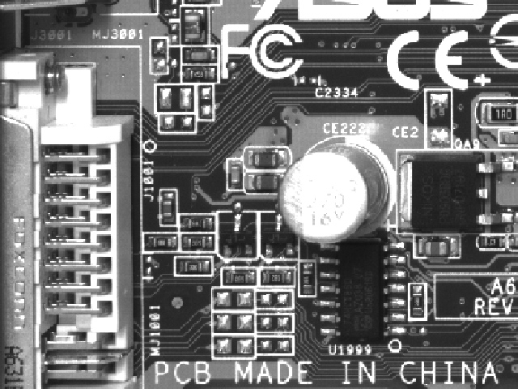

# Độ phân giải của cảm biến

## Tổng quan

Độ phân giải cảm biến của các camera công nghiệp đã được nâng cao đáng kể theo thời gian. Nhờ các quy trình sản xuất được cải thiện, các cấu trúc điểm ảnh nhỏ hơn có thể được thực hiện ngày nay mà vẫn có độ nhạy sáng tương tự như các điểm ảnh lớn trước đây. Hiệu suất lượng tử của các điểm ảnh cũng đã được cải thiện đáng kể. Dưới đây là một số hình ảnh ví dụ chụp bởi một số camera có độ phân giải khác nhau để có thể dễ hình dung mức độ quan trọng của kích thước cảm biến đến hiệu suất kiểm tra.

**Ảnh chụp bằng camera có độ phân giải 5 Megapixel** 

  Hình ảnh cắt ra một phần (640x480 pixel) từ hình ảnh thu dược của camera 5 megapixel, thể hiện 1:1. Cấu trúc hình ảnh rất tốt có thể nhìn thấy được. Phông chữ nhỏ có thể đọc được.

**Ảnh chụp bằng camera có độ phân giải 2 Megapixel**

Hình ảnh cắt một phần (640x480 pixel) từ hình ảnh 2 megapixel, thể hiện 1:1. Cấu trúc hình ảnh rất đẹp nhưng các dòng chữ thành phần không thể đọc được.

**Ảnh chụp bằng camera VGA**

Các chi tiết bị vỡ nét, hình ảnh hầu như rất khó nhìn rõ.

## Cảm biến cho máy ảnh C-mount
